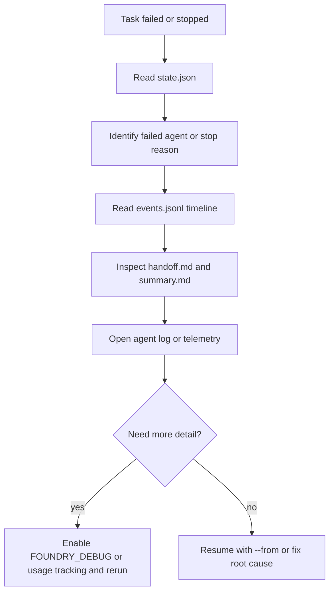
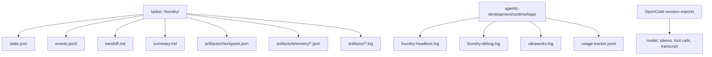

# Root Cause Analysis для Foundry Pipeline / Foundry Pipeline Root Cause Analysis

## Огляд / Overview

Use this guide when a task in `tasks/<slug>--foundry/` stops, fails, or produces an unexpected result. It covers fast triage, debug modes, log analysis, usage tracking, and replaying a run from the right stage.

## Швидкий старт: задача впала — що робити? / Quick Start: Task Failed - What To Do?



1. Find the status and the agent where the run broke.
2. Read the event timeline in `events.jsonl`.
3. Inspect `handoff.md`, `summary.md`, and the failed agent artifacts.
4. If the cause is still unclear, rerun with `FOUNDRY_DEBUG=true` or `FOUNDRY_USAGE_TRACKING=true`.
5. After fixing the cause, continue with `--from <agent>` or `resume`.

Minimal command set:

```bash
TASK_DIR="tasks/<slug>--foundry"

jq '{status, current_step, resume_from, attempt, updated_at}' "$TASK_DIR/state.json"
jq -r '.agents[]? | select(.status == "failed") | .agent' "$TASK_DIR/state.json"
jq -r '[.timestamp, .type, (.step // "-"), (.message // "-")] | @tsv' "$TASK_DIR/events.jsonl"
```

## Режими дебагу / Debug Modes

### `FOUNDRY_DEBUG=true`

Enables detailed stderr/debug tracing for state-management operations.

```bash
FOUNDRY_DEBUG=true ./agentic-development/foundry.sh run --task-file /absolute/path/to/task.md

# or via .env.local
printf 'FOUNDRY_DEBUG=true\n' >> .env.local
./agentic-development/foundry.sh headless
```

Useful files:

- `agentic-development/runtime/logs/foundry-debug.log`
- `agentic-development/runtime/logs/foundry-headless.log`
- `tasks/<slug>--foundry/state.json`

### `FOUNDRY_USAGE_TRACKING=true`

Logs calls to instrumented Bash/TypeScript helpers in JSONL format.

```bash
FOUNDRY_USAGE_TRACKING=true ./agentic-development/foundry.sh headless
```

Useful file:

- `agentic-development/runtime/logs/usage-tracker.jsonl`

Line format:

```json
{"ts":"2026-03-26T20:40:25Z","fn":"foundry_task_counts","src":"foundry-common.sh","pid":3930}
```

### Сесії OpenCode / OpenCode Sessions

Use a session export when you need the full tool-call transcript, prompt context, and token data.

```bash
opencode session list --format json -n 20

# If your CLI supports session export
opencode session export <session-id>

# Current runtime helpers also use this variant
opencode export <session-id>
```

## Поширені патерни збоїв / Common Failure Patterns

| Symptom | Likely cause | What to do |
|---|---|---|
| `status=stopped`, `stop_reason=dirty_default_workspace` | The workspace has uncommitted changes | Clean up or commit changes, then run `./agentic-development/foundry.sh resume <slug>` |
| Failure at `u-validator` or `u-tester` | Real code issue or flaky test | Read `handoff.md`, `summary.md`, agent log, then rerun with `--from u-validator` or `--from u-tester` |
| `preflight_failed` or `dependency_unavailable` | Services are down or dependencies are missing | Run `./agentic-development/foundry.sh env-check`, then inspect `docker compose ps` |
| No clear error, but the task appears stuck | Normal logs do not provide enough signal | Rerun with `FOUNDRY_DEBUG=true` and inspect `foundry-debug.log` |
| Agent completed, but token/cost numbers look wrong | Fallback model or repeated calls happened | Check `state.json`, `artifacts/checkpoint.json`, `artifacts/telemetry/*.json`, and an OpenCode session export |
| Multiple related E2E failures appear together | One upstream root cause affects several scenarios | Build a timeline, find the first failure, and group by flow rather than by each individual test |

## Команди аналізу логів / Log Analysis Commands

### Знайти агент, який впав / Find the failed agent

```bash
TASK_DIR="tasks/<slug>--foundry"

jq -r '.current_step, .resume_from' "$TASK_DIR/state.json"
jq -r '.agents[]? | select(.status == "failed") | .agent' "$TASK_DIR/state.json"
jq -r '.agents[]? | [.agent, .status, (.duration_seconds // 0), (.cost // 0)] | @tsv' "$TASK_DIR/state.json"
```

### Прочитати таймлайн подій / Read the events timeline

```bash
TASK_DIR="tasks/<slug>--foundry"

jq -r '[.timestamp, .type, (.step // "-"), (.message // "-")] | @tsv' "$TASK_DIR/events.jsonl"
```

### Перевірити токени і вартість / Check token usage and cost

```bash
TASK_DIR="tasks/<slug>--foundry"

jq '{agents}' "$TASK_DIR/state.json"
jq '.' "$TASK_DIR/artifacts/checkpoint.json"
jq -s 'map({agent, model, tokens, cost})' "$TASK_DIR"/artifacts/telemetry/*.json
```

### Знайти точну помилку в логах агента / Find the exact error in agent logs

```bash
TASK_DIR="tasks/<slug>--foundry"
FAILED_AGENT=$(jq -r '.agents[]? | select(.status == "failed") | .agent' "$TASK_DIR/state.json" | head -n 1)

ls "$TASK_DIR/artifacts/$FAILED_AGENT"
rg -n "ERROR|FAILED|Exception|Traceback|panic|fatal" "$TASK_DIR/artifacts/$FAILED_AGENT"
```

### Перевірити, чи працювали сервіси / Check whether services were running

```bash
./agentic-development/foundry.sh env-check
./agentic-development/foundry.sh env-check --app core
docker compose ps postgres redis opensearch rabbitmq
```

### Подивитися headless/runtime журнали / Inspect runtime logs

```bash
rg -n "ERROR|WARN|failed|stopped" agentic-development/runtime/logs/foundry-headless.log
rg -n "ERROR|WARN|failed|stopped" agentic-development/runtime/logs/ultraworks.log
rg -n "ERROR|WARN|failed|stopped" agentic-development/runtime/logs/foundry-debug.log
```

## Аналіз usage tracking / Usage Tracking Analysis

Usage tracking helps when you need to learn which helpers are actually exercised and which ones may have become dead code.

```bash
# Most frequently called functions
jq -r '.fn' agentic-development/runtime/logs/usage-tracker.jsonl | sort | uniq -c | sort -rn

# Which foundry_* helpers were called
jq -r 'select(.fn | startswith("foundry_")) | .fn' agentic-development/runtime/logs/usage-tracker.jsonl | sort | uniq -c

# Which functions do not appear in the sample
jq -r '.fn' agentic-development/runtime/logs/usage-tracker.jsonl | sort -u > /tmp/used-functions.txt
rg -No '^[a-zA-Z_][a-zA-Z0-9_]*\(\) \{' agentic-development/lib | sed 's/() {//' | sort -u > /tmp/declared-functions.txt
comm -23 /tmp/declared-functions.txt /tmp/used-functions.txt
```

Practical flow:

1. Enable `FOUNDRY_USAGE_TRACKING=true` for several real runs.
2. Compare declared helpers against the functions that were actually observed.
3. Review dead-code candidates manually before deleting anything, because some helpers only run during rare recovery paths.

## Відтворення проблем / Reproducing Issues

### Повторити повний запуск з debug / Rerun the whole task with debug

```bash
FOUNDRY_DEBUG=true ./agentic-development/foundry.sh run --task-file /absolute/path/to/task.md
```

### Продовжити з конкретного агента / Resume from a specific agent

```bash
./agentic-development/foundry.sh run --from u-validator "<same task prompt>"
./agentic-development/foundry.sh run --from u-tester "<same task prompt>"
```

### Відновити stopped-задачу / Resume a stopped task

```bash
./agentic-development/foundry.sh resume <task-slug>
```

### Створити задачі з готового E2E report / Recreate tasks from an existing E2E report

```bash
./agentic-development/foundry.sh autotest 5 --from-report .opencode/pipeline/reports/<report>.json --start
```

Tip: if the issue only reproduces in one stage, do not rerun the full chain. Start from `--from <agent>` and keep the previous artifacts for comparison.

## Де живуть логи / Where Logs Live



Quick reference:

- `state.json` - current status, failed agent, resume point, and per-agent cost.
- `events.jsonl` - transition timeline and fail/stop events.
- `handoff.md` - short context passed between agents.
- `artifacts/checkpoint.json` - execution checkpoint and planned agents.
- `artifacts/telemetry/*.json` - tokens, model, cost, tools, and files.
- `agentic-development/runtime/logs/*.log` - wrapper/headless/runtime signals.
