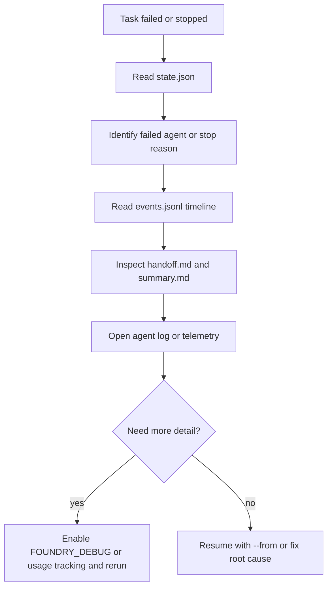
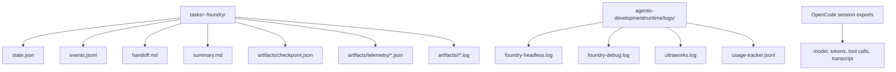

# Root Cause Analysis для Foundry Pipeline / Foundry Pipeline Root Cause Analysis

## Огляд / Overview

Цей гайд потрібен, коли задача у `tasks/<slug>--foundry/` зупинилася, впала або дала дивний результат. Він покриває швидку діагностику, debug-режими, аналіз логів, usage tracking і повторний запуск з потрібного етапу.

## Швидкий старт: задача впала — що робити? / Quick Start: Task Failed - What To Do?



1. Знайди статус і агент, на якому все зламалося.
2. Прочитай таймлайн подій у `events.jsonl`.
3. Перевір `handoff.md`, `summary.md` і артефакти проблемного агента.
4. Якщо причина неочевидна, повтори запуск з `FOUNDRY_DEBUG=true` або `FOUNDRY_USAGE_TRACKING=true`.
5. Після виправлення проблеми віднови задачу з `--from <agent>` або `resume`.

Мінімальний набір команд:

```bash
TASK_DIR="tasks/<slug>--foundry"

jq '{status, current_step, resume_from, attempt, updated_at}' "$TASK_DIR/state.json"
jq -r '.agents[]? | select(.status == "failed") | .agent' "$TASK_DIR/state.json"
jq -r '[.timestamp, .type, (.step // "-"), (.message // "-")] | @tsv' "$TASK_DIR/events.jsonl"
```

## Режими дебагу / Debug Modes

### `FOUNDRY_DEBUG=true`

Вмикає детальний stderr/debug trace для операцій state-management.

```bash
FOUNDRY_DEBUG=true ./agentic-development/foundry run --task-file /absolute/path/to/task.md

# або через .env.local
printf 'FOUNDRY_DEBUG=true\n' >> .env.local
./agentic-development/foundry headless
```

Корисні файли:

- `agentic-development/runtime/logs/foundry-debug.log`
- `agentic-development/runtime/logs/foundry-headless.log`
- `tasks/<slug>--foundry/state.json`

### `FOUNDRY_USAGE_TRACKING=true`

Логує виклики інструментованих Bash/TypeScript функцій у JSONL.

```bash
FOUNDRY_USAGE_TRACKING=true ./agentic-development/foundry headless
```

Корисний файл:

- `agentic-development/runtime/logs/usage-tracker.jsonl`

Формат рядка:

```json
{"ts":"2026-03-26T20:40:25Z","fn":"foundry_task_counts","src":"foundry-common.sh","pid":3930}
```

### Сесії OpenCode / OpenCode Sessions

Використовуй сесію, коли треба побачити повний transcript викликів tools, prompt context і токени.

```bash
opencode session list --format json -n 20

# Якщо CLI підтримує session export
opencode session export <session-id>

# Поточні runtime helper-и також використовують цей варіант
opencode export <session-id>
```

## Поширені патерни збоїв / Common Failure Patterns

| Симптом | Ймовірна причина | Що робити |
|---|---|---|
| `status=stopped`, `stop_reason=dirty_default_workspace` | У workspace є незакомічені зміни | Очистити або закомітити зміни, потім `./agentic-development/foundry resume <slug>` |
| Падіння на `u-validator` або `u-tester` | Реальна помилка в коді або флейковий тест | Подивитися `handoff.md`, `summary.md`, agent log, потім перезапустити з `--from u-validator` або `--from u-tester` |
| `preflight_failed` або `dependency_unavailable` | Не підняті сервіси, бракує залежностей | Запустити `./agentic-development/foundry env-check`, перевірити `docker compose ps` |
| Немає зрозумілої помилки, але задача зависає | Мало сигналів у звичайних логах | Повторити запуск з `FOUNDRY_DEBUG=true` і прочитати `foundry-debug.log` |
| Агент відпрацював, але витрати або токени дивні | Fallback model або кілька повторних викликів | Перевірити `state.json`, `artifacts/checkpoint.json`, `artifacts/telemetry/*.json`, export сесії OpenCode |
| Після E2E з'явилося кілька пов'язаних fail-ів | Одна upstream-причина в кількох сценаріях | Зібрати таймлайн, знайти перший fail, групувати за flow, а не за кожним окремим тестом |

## Команди аналізу логів / Log Analysis Commands

### Знайти агент, який впав / Find the failed agent

```bash
TASK_DIR="tasks/<slug>--foundry"

jq -r '.current_step, .resume_from' "$TASK_DIR/state.json"
jq -r '.agents[]? | select(.status == "failed") | .agent' "$TASK_DIR/state.json"
jq -r '.agents[]? | [.agent, .status, (.duration_seconds // 0), (.cost // 0)] | @tsv' "$TASK_DIR/state.json"
```

### Прочитати таймлайн подій / Read the events timeline

```bash
TASK_DIR="tasks/<slug>--foundry"

jq -r '[.timestamp, .type, (.step // "-"), (.message // "-")] | @tsv' "$TASK_DIR/events.jsonl"
```

### Перевірити токени і вартість / Check token usage and cost

```bash
TASK_DIR="tasks/<slug>--foundry"

jq '{agents}' "$TASK_DIR/state.json"
jq '.' "$TASK_DIR/artifacts/checkpoint.json"
jq -s 'map({agent, model, tokens, cost})' "$TASK_DIR"/artifacts/telemetry/*.json
```

### Знайти точну помилку в логах агента / Find the exact error in agent logs

```bash
TASK_DIR="tasks/<slug>--foundry"
FAILED_AGENT=$(jq -r '.agents[]? | select(.status == "failed") | .agent' "$TASK_DIR/state.json" | head -n 1)

ls "$TASK_DIR/artifacts/$FAILED_AGENT"
rg -n "ERROR|FAILED|Exception|Traceback|panic|fatal" "$TASK_DIR/artifacts/$FAILED_AGENT"
```

### Перевірити, чи працювали сервіси / Check whether services were running

```bash
./agentic-development/foundry env-check
./agentic-development/foundry env-check --app core
docker compose ps postgres redis opensearch rabbitmq
```

### Подивитися headless/runtime журнали / Inspect runtime logs

```bash
rg -n "ERROR|WARN|failed|stopped" agentic-development/runtime/logs/foundry-headless.log
rg -n "ERROR|WARN|failed|stopped" agentic-development/runtime/logs/ultraworks.log
rg -n "ERROR|WARN|failed|stopped" agentic-development/runtime/logs/foundry-debug.log
```

## Аналіз usage tracking / Usage Tracking Analysis

Usage tracking корисний, коли треба зрозуміти, які helper-и реально викликаються, а які стали мертвим кодом.

```bash
# Найчастіше викликані функції
jq -r '.fn' agentic-development/runtime/logs/usage-tracker.jsonl | sort | uniq -c | sort -rn

# Які foundry_* helper-и викликалися
jq -r 'select(.fn | startswith("foundry_")) | .fn' agentic-development/runtime/logs/usage-tracker.jsonl | sort | uniq -c

# Які функції не зустрічаються у вибірці конкретного запуску
jq -r '.fn' agentic-development/runtime/logs/usage-tracker.jsonl | sort -u > /tmp/used-functions.txt
rg -No '^[a-zA-Z_][a-zA-Z0-9_]*\(\) \{' agentic-development/lib | sed 's/() {//' | sort -u > /tmp/declared-functions.txt
comm -23 /tmp/declared-functions.txt /tmp/used-functions.txt
```

Практичний підхід:

1. Увімкни `FOUNDRY_USAGE_TRACKING=true` на кілька реальних запусків.
2. Порівняй список задекларованих і реально викликаних функцій.
3. Перевір кандидати в dead code вручну перед видаленням: частина helper-ів може бути для рідкісних recovery-сценаріїв.

## Відтворення проблем / Reproducing Issues

### Повторити повний запуск з debug / Rerun the whole task with debug

```bash
FOUNDRY_DEBUG=true ./agentic-development/foundry run --task-file /absolute/path/to/task.md
```

### Продовжити з конкретного агента / Resume from a specific agent

```bash
./agentic-development/foundry run --from u-validator "<same task prompt>"
./agentic-development/foundry run --from u-tester "<same task prompt>"
```

### Відновити stopped-задачу / Resume a stopped task

```bash
./agentic-development/foundry resume <task-slug>
```

### Створити задачі з готового E2E report / Recreate tasks from an existing E2E report

```bash
./agentic-development/foundry autotest 5 --from-report .opencode/pipeline/reports/<report>.json --start
```

Порада: якщо проблема відтворюється тільки на одному етапі, не запускай весь ланцюг заново. Почни з `--from <agent>` і збережи попередні артефакти для порівняння.

## Де живуть логи / Where Logs Live



Коротка пам'ятка:

- `state.json` — поточний статус, агент, resume point, витрати по агентам.
- `events.jsonl` — таймлайн переходів і fail/stop подій.
- `handoff.md` — короткий контекст між агентами.
- `artifacts/checkpoint.json` — контрольна точка виконання і planned agents.
- `artifacts/telemetry/*.json` — токени, модель, cost, tools, files.
- `agentic-development/runtime/logs/*.log` — wrapper/headless/runtime signal.
